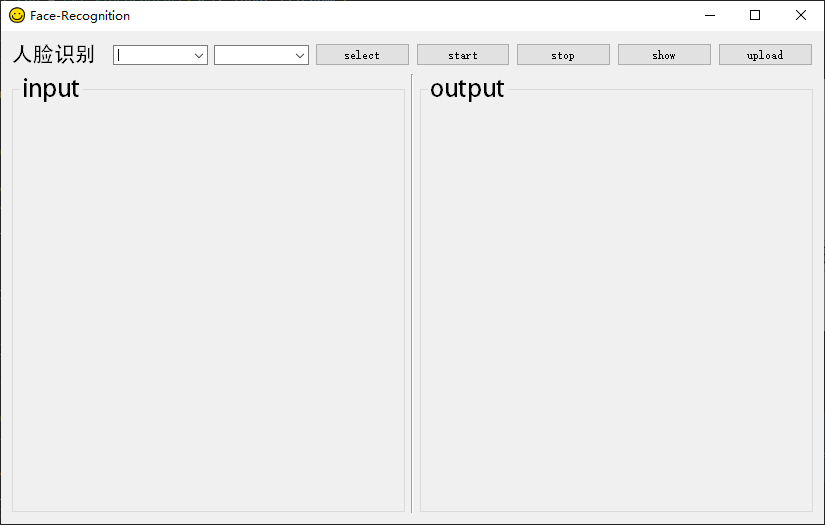

<!-- PROJECT LOGO -->
<br />
<div align="center">
  

<h3 align="center">Face Recognition Sys</h3>
<a href="./README_ch.md">Chinese</a>

</div>
 

<!-- ABOUT THE PROJECT -->
## About The Project
<div align="center">

</div>
This system implements face recognition based on YOLOV5s + ArcFace/FaceNet. The YOLOV5s model is used for face detection, ArcFace/FaceNet is used for face recognition, and PySide2 + Qt Designer is used to design the system UI.


## Quick Start

This is an example of how you may set up your project locally.
To get a local copy up and running follow these simple example steps.


1. Clone the repo
```sh
git clone https://github.com/qqizhao/FaceRecognitionSys
```

2. Start the system
```sh
python login.py

python window.py  # If you do not need to upload the recognition results to the database, you can directly run window.py
```


<!-- ACKNOWLEDGMENTS -->
## Acknowledgments

* https://blog.csdn.net/qq_41334243/article/details/107425492  
* https://blog.csdn.net/weixin_41809530/article/details/107313752  
* https://github.com/BlackFeatherQQ/FaceRecognition?login=from_csdn  
* https://github.com/ultralytics/yolov5 

